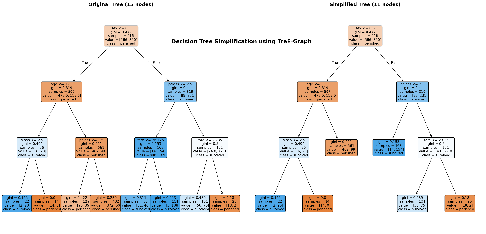

# TreE-Graph

[](https://pypi.org/project/tree-graph/)
[](https://pypi.org/project/tree-graph/)
[](https://opensource.org/licenses/MIT)
[](https://github.com/tree-graph/tree-graph/actions/workflows/ci.yml)

**TreE-Graph** simplifies [scikit-learn](https://scikit-learn.org/) decision trees using e-graphs (equality graphs) and equality saturation via [egglog](https://github.com/egraphs-good/egglog).

By encoding decision tree structures into an e-graph, TreE-Graph applies mathematically sound rewrite rules to eliminate redundant splits, remove unreachable nested conditions, and collapse identical subtrees—yielding smaller, faster, and more interpretable trees while strictly preserving original model predictions.

---

## Highlights

- **Exact Equivalence**: Simplifications preserve predictions across all training and evaluation samples.
- **Strict Verification Mode**: Optional `strict=True` raises an exception if predictions ever diverge from the original model.
- **Classification & Regression**: Native support for both `DecisionTreeClassifier` (multi-class) and `DecisionTreeRegressor`.
- **Drop-in scikit-learn Integration**: Takes a fitted scikit-learn tree and outputs an optimized, fully functional scikit-learn tree with valid underlying C-structures.
- **Zero Heavy Graph Overhead**: Powered by `egglog`'s high-performance Rust core.

---

## Installation

```bash
pip install tree-graph
```

Or with [uv](https://github.com/astral-sh/uv):

```bash
uv add tree-graph
```

To include visualization dependencies (matplotlib):

```bash
pip install "tree-graph[viz]"
```

**Requirements:**
- Python 3.10+
- `scikit-learn >= 1.0`
- `egglog >= 7.0`
- `numpy >= 1.21`

---

## Quick Start

### Functional API

The easiest way to simplify a tree is using the `simplify_tree` function:

```python
from sklearn.datasets import load_iris
from sklearn.tree import DecisionTreeClassifier
from tree_graph import simplify_tree

# 1. Train a scikit-learn decision tree
X, y = load_iris(return_X_y=True)
clf = DecisionTreeClassifier(max_depth=5, random_state=42)
clf.fit(X, y)

print(f"Original tree: {clf.tree_.node_count} nodes")

# 2. Simplify using e-graph rewriting
simplified_clf = simplify_tree(clf, X, y, rule_set="full")

print(f"Simplified tree: {simplified_clf.tree_.node_count} nodes")
assert (clf.predict(X) == simplified_clf.predict(X)).all()
```

### Object-Oriented API & Statistics

For detailed statistics and configuration, use `TreeSimplifier`:

```python
from tree_graph import TreeSimplifier

simplifier = TreeSimplifier(
    rule_set="full",
    max_iterations=100,
    strict=True,  # Raises ValueError if predictions ever diverge
)

result = simplifier.simplify_with_stats(clf, X, y)

print(f"Nodes before: {result.original_node_count}")
print(f"Nodes after:  {result.simplified_node_count}")
print(f"Reduction:    {result.reduction_percentage:.1f}%")
print(f"Predictions preserved: {result.predictions_preserved}")

# Use the simplified estimator
simplified_clf = result.estimator
```

---

## How It Works

TreE-Graph maps a decision tree into a functional term representation:

- **Condition**: feature index and threshold split (`Feature(i) <= Threshold(t)`)
- **Node**: `If(condition, then_branch, else_branch)`
- **Leaf**: `Leaf(value)`

These terms are loaded into an `egglog.EGraph`. During equality saturation, rewrite rules discover equivalent, more compact tree topologies without combinatorial explosion:

```
          [Feature 0 <= 2.45]                           [Feature 0 <= 2.45]
             /           \                                 /           \
        Leaf(0)     [Feature 1 <= 1.75]       -->     Leaf(0)        Leaf(1)
                       /           \
                   Leaf(1)       Leaf(1)  <-- Redundant split collapsed!
```

After saturation, an optimal (minimal size) tree term is extracted and converted back into a standard scikit-learn tree with updated decision paths, node counts, and impurities.

---

## Rule Sets

| Rule Set | Description | Rewrites Applied |
|---|---|---|
| `"basic"` | Minimal conservative simplification | **Redundant Split Elimination**: `If(c, a, a) -> a` |
| `"full"` (default) | Comprehensive simplification | Basic + **Idempotent Nested Split Pruning**: `If(c, If(c, a, b), d) -> If(c, a, d)` and `If(c, d, If(c, a, b)) -> If(c, d, b)` + **Homogeneous Subtree Collapsing** |

---

## Visualizing Simplification

The `examples/` directory includes a script demonstrating hyperparameter grid search, tree reduction, and diagnostic plots (ROC curves, log-loss distributions, and confusion matrices). It can be used with different scikit-learn datasets (`iris`, `wine`, `breast_cancer`, `digits`, `titanic`, `moons`, `blobs`, `classification`):

```bash
git clone https://github.com/tree-graph/tree-graph.git
cd tree-graph
pip install -e ".[viz]"

# Run with default dataset (iris)
python examples/decision_tree.py

# Or specify a different scikit-learn dataset
python examples/decision_tree.py --dataset wine
python examples/decision_tree.py --dataset breast_cancer
python examples/decision_tree.py --dataset digits
python examples/decision_tree.py --dataset titanic
```

Generated plots:
- `examples/decision_tree_comparison.png`: Side-by-side visualization of original vs. simplified trees.
- `examples/decision_tree_confusion_matrix.png`: Confusion matrices verifying identical classification boundaries.
- `examples/decision_tree_roc_curves.png`: Multi-class ROC curves.

### Decision Tree Comparison Example (Titanic Dataset)

Below is the comparison plot generated for the Titanic dataset, showing the original decision tree (15 nodes) simplified down to 11 nodes while preserving identical predictions:



---

## Development

We use `uv` and standard modern tooling:

```bash
# Clone the repository
git clone https://github.com/tree-graph/tree-graph.git
cd tree-graph

# Create virtual environment and install in development mode
uv venv
source .venv/bin/activate
uv pip install -e ".[dev,viz]"

# Run tests with coverage
pytest tests/ --cov=tree_graph

# Check formatting and linting
ruff check .
ruff format --check .

# Run static type checking
mypy src/ tests/
```

---

## Contributing

Contributions, issues, and feature requests are welcome! Feel free to check the [issues page](https://github.com/tree-graph/tree-graph/issues).

---

## License

This project is licensed under the MIT License - see the [LICENSE](LICENSE) file for details.
